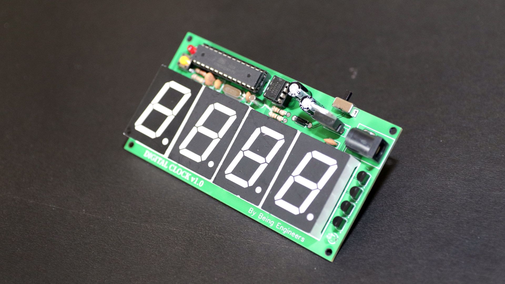

# arduino-digital-clock
Hey guys, hope you all are doing great. Thanks for tuning in. This time I have made a digital clock using Arduino. This is kind of those short and simple project which is doable by anyone. So Let us know your thoughts on it.

